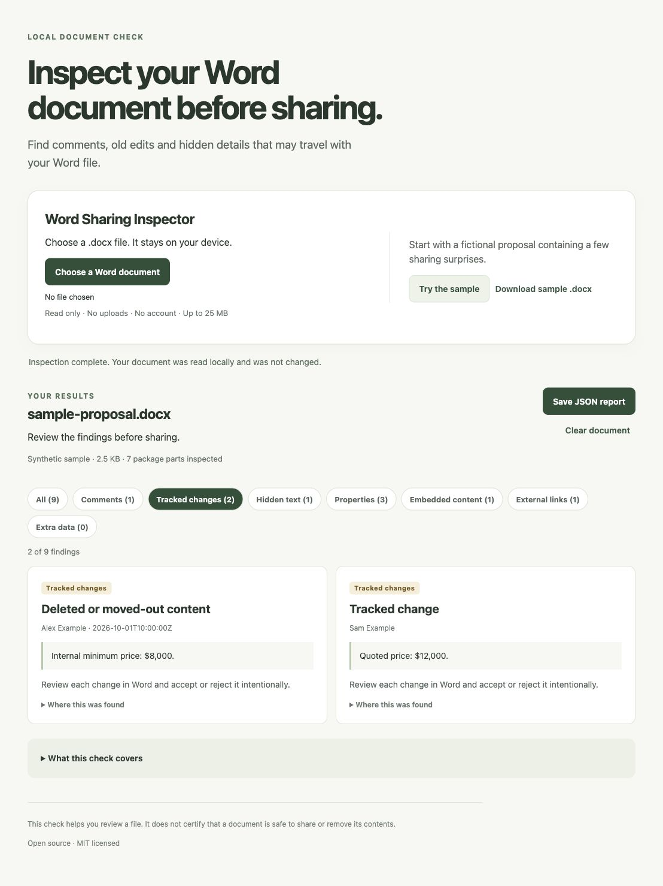

# DOCX Metadata Inspector — Word Sharing Inspector

[](https://github.com/73sharath73/word-sharing-inspector/actions/workflows/ci.yml)

**Check what travels with a Word document before you share it.**

Word Sharing Inspector finds saved comments, tracked changes, hidden text and selected document metadata in `.docx` files. It runs locally in your browser, shows the details for review, and leaves the original file unchanged.



*Fictional sample. Your document is not uploaded. This is an inspector, not a cleaner or a guarantee that a file is safe to share.*

## Try the browser app

Download the **[prebuilt browser ZIP](https://github.com/73sharath73/word-sharing-inspector/releases/download/v0.1.1/word-sharing-inspector-0.1.1-browser.zip)** and extract it. With Node 22+ installed, run this inside the extracted folder:

```sh
node serve.js
```

Open **http://127.0.0.1:8765**, click **Try the sample**, or choose a `.docx` file. No npm installation or build is needed for this ZIP. The included server accepts only GET/HEAD and binds to your own computer.

Prefer the source checkout?

```sh
git clone https://github.com/73sharath73/word-sharing-inspector.git
cd word-sharing-inspector
npm ci
npm run build
npm start
```

## What it shows

- **Comments and tracked changes**, including stored deleted text and reviewer identities.
- **Hidden text and selected metadata**, such as author, last-saved-by and custom properties.
- **Embedded/imported content and external links** that need separate review.
- **A local JSON report** you can save, with the original file's SHA-256 fingerprint.

No account, uploads, analytics or model API. Inspection runs in a browser worker. The app never opens document links or executes embedded content. Findings and reports may include names and excerpts; review them before sharing.

## CLI and library

```sh
node bin/word-sharing-inspector.js document.docx
node bin/word-sharing-inspector.js document.docx --output report.json
```

```js
import {inspect} from './src/inspect.js';
const report = inspect(documentBytes, {filename: 'proposal.docx'});
```

Exit `0`: no findings in the checks performed; `1`: findings; `2`: unsupported/invalid document or error. The CLI refuses an output path that aliases the original file.

## Coverage and feedback

Supports ordinary macro-free `.docx` files up to 25 MB. It does not inspect image contents, embedded-file internals, cloud history or every inherited style, and it does not remove content. Native Word/LibreOffice rendering has not been tested.

[Full coverage and limits](docs/COVERAGE.md) · [Validation evidence](VALIDATION.md) · [Comparison with existing tools](BENCHMARK.md)

Try the fictional sample first. [Tell us which findings are useful or confusing](https://github.com/73sharath73/word-sharing-inspector/issues/new). Share a sanitized report or a fictional reproduction rather than a sensitive document.

[How do I check Word metadata before sharing?](docs/check-word-metadata.md)

## Development

```sh
npm test
npm run build
```

MIT licensed · [Releases](https://github.com/73sharath73/word-sharing-inspector/releases) · [Contributing](CONTRIBUTING.md) · [Security](SECURITY.md) · [Dependency notices](THIRD_PARTY_NOTICES.md)

Initial experimental releases are published on GitHub; npm registry publication has not occurred.
